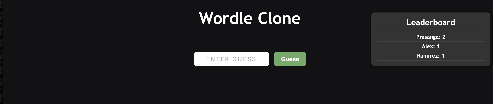
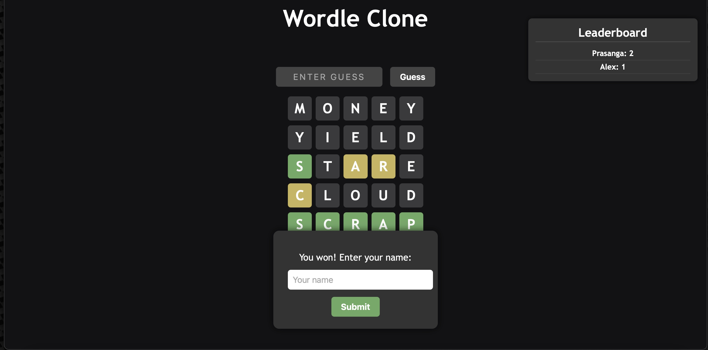

# Wordle Clone

Welcome to Wordle Clone, a simple implementation of the popular Wordle game. This project features a JavaScript frontend paired with a Spring Boot backend to implement an interactive word-guessing game with persistent player scores and a competitive leaderboard.

The JavaScript frontend is responsible for:

- Interactive UI built with vanilla JavaScript
- Real-time feedback on guesses
- Player name submission and score saving on successful guesses
- Leaderboard display showing top five players

The Spring Boot backend handles:

- RESTful API endpoints for:
	- Random word selection
	- Player score tracking and updating
	- Leaderboard retrieval (top players by score)
- Persistent storage of player data using Spring Data JPA with H2 database
- Ensuring scores are saved and retrieved for a dynamic, competitive leaderboard experience

# Run Locally with Docker

> Make sure you have [Docker installed](https://docs.docker.com/get-docker/).

### 1. Clone the repository

```bash
git clone https://github.com/paryal58/wordleClone.git wordle
```
```
cd wordle
```

### 2. Pull the docker image
```
docker run -d --name wordle-backend \
  -p 8080:8080 \
  -v wordle-data:/app/data \
  prasanga017/wordle-backend:latest
```

### 3. Run the game
Visit the following game in your favorite browser:
```
http://localhost:8080/index.html
```

# Screenshot



